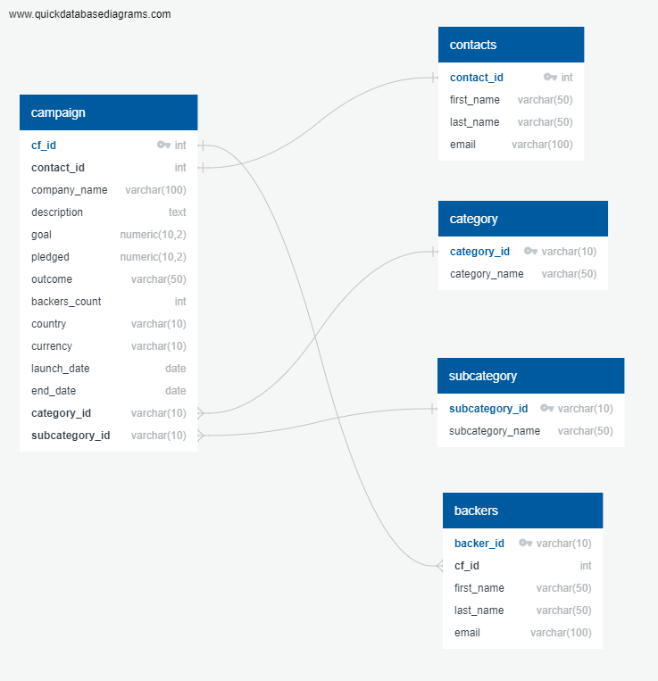

# Crowdfunding-ETL

## Overview of the Project

Independent Funding is a crowdfunding platform for funding independent projects or ventures.
Independent Funding has been growing, so now it needs to move all their accessible data from one large Excel file onto a PostgreSQL database. This way, the analytics team will be able to perform analysis and create reports for company stakeholders as well as individuals who donate to projects.

Britta, a junior SQL developer, has been tasked with the following :

-   Extracting and transforming the data from the large Excel file into separate CSV files using Python and Pandas

-   Creating a PostgreSQL database and tables by using an ERD

-	Loading the CSV files into the database

-	Performing SQL queries to generate reports for stakeholders

### Procedure 

1. The campaign data is extracted from a crowdfunding excel sheet, cleaned, dates converted and unnecessary columns dropped. The category and subcategory are separated into two different columns. 

2. The unique category and subcategory are extracted from the respective columns and unique category-id and subcategory-id is generated. The category-id and subcategory-id is then added to the campaign data and the category and subcategory columns are dropped.

3. The contacts information is extracted from the crowdfunding excel and parsed to extract the contacts data.

4. The backers information is also extracted and parsed to extract relevant data.

5. An ERD is created to understand the database structure.

6. Using the ERD and schema, tables are created and data loaded in them.

7. [SQL](crowdfunding_SQL_Analysis.sql) queries are written to generate a list of contacts for every live campaign so that an email can be sent to them to inform how much of the goal remains.

8. Similar [SQL](crowdfunding_SQL_Analysis.sql) query is written to generate a list of backers for every live campaign so that an email can be sent to them to inform how much goal remains. 
